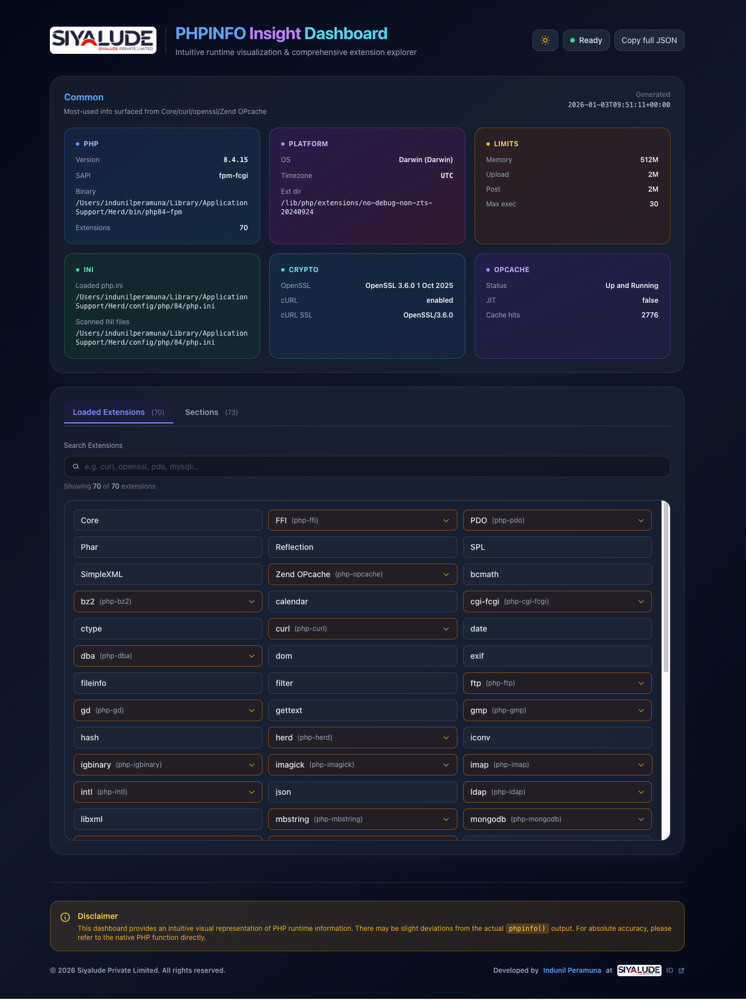

# PHPINFO Insight Dashboard

[](https://opensource.org/licenses/MIT)
[](https://www.php.net/)

An intuitive, modern web dashboard for visualizing PHP runtime information (`phpinfo()`) with a beautiful UI, comprehensive extension explorer, and secure token-based authentication.



## ✨ Features

- 🎨 **Modern UI** - Beautiful, responsive interface with dark mode support
- 🔍 **Comprehensive Extension Explorer** - Browse all loaded PHP extensions with detailed information
- 📊 **Rich Visualization** - Organized display of PHP configuration, limits, and runtime data
- 🔐 **Secure Authentication** - Token-based access control with SHA-256 hashing
- 📦 **Standalone Build** - Single-file deployment with embedded CSS/JS
- 🔄 **Real-time Updates** - Refresh and reload PHP information on demand
- 📋 **JSON Export** - Copy or download full JSON data for any section
- 🌙 **Dark Mode** - Automatic theme detection with manual toggle
- 📱 **Responsive Design** - Works seamlessly on desktop and mobile devices

## 🚀 Quick Start

### Option 1: Automated Installation (Recommended)

Install via curl:

```bash
curl -fsSL http://siyalude.io/php/phpinfo-insight-dashboard-install.sh | sh
```

Or download and run:

```bash
curl -fsSL http://siyalude.io/php/phpinfo-insight-dashboard-install.sh -o install.sh
sh install.sh
```

The script will:
- Prompt you to enter a secure token
- Download the latest release
- Create `piid.txt` with your token hash
- Set proper file permissions

### Option 2: Manual Installation

1. **Download the latest release:**
   ```bash
   wget https://github.com/siyaludeio/phpinfo-insight-dashboard/releases/latest/download/phpinfo-insight-dashboard.php
   ```

2. **Generate a token hash:**
   ```bash
   python3 generate-token.py
   ```
   Or manually create `piid.txt` with a SHA-256 hash of your token:
   ```bash
   echo -n "your-secure-token" | shasum -a 256 | cut -d' ' -f1 > piid.txt
   chmod 600 piid.txt
   ```

3. **Place the file in your web directory:**
   ```bash
   mv phpinfo-insight-dashboard.php /path/to/your/web/directory/
   mv piid.txt /path/to/your/web/directory/
   ```

## 📖 Usage

### Access the Dashboard

Navigate to your dashboard URL with your token:

```
http://your-domain.com/phpinfo-insight-dashboard.php?token=YOUR_TOKEN
```

### Default Token (Development Only)

If `piid.txt` doesn't exist, the dashboard uses a default token:
- **Token:** `siyalude-phpinfo-viewer-token`
- **Environment Variable:** Set `PHPINFO_TOKEN` environment variable

⚠️ **Warning:** Always use a custom token in production!

### Dashboard Sections

1. **Common** - Quick overview of PHP version, platform, limits, and key configurations
2. **Loaded Extensions** - Searchable list of all loaded PHP extensions
3. **Sections** - Detailed view of all phpinfo sections with full configuration data

### Features

- **Search** - Filter extensions and sections by name, keys, or values
- **Expand/Collapse** - View detailed information for any section
- **Copy JSON** - Copy section data as JSON to clipboard
- **Download JSON** - Download section data as a JSON file
- **Theme Toggle** - Switch between light and dark modes

## 🔧 Configuration

### Token Management

#### Generate a New Token Hash

```bash
python3 generate-token.py
```

This will:
- Prompt for your token
- Generate SHA-256 hash
- Save to `piid.txt` with secure permissions (600)

#### Update Existing Token

Simply run `generate-token.py` again and overwrite `piid.txt`.

### Environment Variables

You can set a default token via environment variable:

```bash
export PHPINFO_TOKEN="your-secure-token"
```

This is used as a fallback when `piid.txt` doesn't exist.

## 🛠️ Development

### Building Standalone Version

The standalone version embeds all CSS and JavaScript inline for single-file deployment:

```bash
python3 build-standalone.py
```

This will:
- Download Tailwind CSS v4 (JavaScript)
- Download Alpine.js
- Embed both inline in the PHP file
- Output to `build/phpinfo-insight-dashboard.php`

### Creating Releases

```bash
python3 create-release.py
```

This script will:
- Check for existing build file or rebuild if needed
- Create a Git tag
- Create a GitHub release
- Upload the build file as a release asset

### Project Structure

```
.
├── src/
│   └── phpinfo-insight-dashboard.php  # Source file
├── build/
│   └── phpinfo-insight-dashboard.php  # Built standalone version
├── build-standalone.py                 # Build script
├── create-release.py                   # Release creation script
├── generate-token.py                   # Token hash generator
├── phpinfo-insight-dashboard-install.sh # Installation script
└── README.md                           # This file
```

## 🔒 Security

### Token Security

- Tokens are hashed using SHA-256 (one-way encryption)
- Hash is stored in `piid.txt` with restricted permissions (600)
- Token is never stored in plain text
- Use strong, unique tokens in production

### Access Control

- Invalid tokens show a 404 page
- Dashboard sections are hidden for invalid tokens
- JSON endpoint returns 403 for invalid tokens
- Ready button shows "Forbidden" and is disabled for invalid tokens

### Best Practices

1. **Use Strong Tokens** - Generate random, complex tokens
2. **Restrict File Permissions** - Ensure `piid.txt` is readable only by the web server
3. **Use HTTPS** - Always serve the dashboard over HTTPS
4. **Regular Updates** - Keep the dashboard updated to the latest release
5. **Monitor Access** - Review server logs for unauthorized access attempts

## 📋 Requirements

- **PHP:** 7.4 or higher
- **PHP Extensions:**
  - `dom` - Required for parsing phpinfo() HTML
  - `json` - Required for JSON encoding/decoding
- **Web Server:** Apache, Nginx, or any PHP-compatible server
- **Python 3:** (Optional) For build scripts and token generation

## 🌐 Browser Support

- Chrome/Edge (latest)
- Firefox (latest)
- Safari (latest)
- Mobile browsers (iOS Safari, Chrome Mobile)

## 📝 License

This project is licensed under the MIT License - see the [LICENSE](LICENSE) file for details.

## 👨‍💻 Credits

Developed by [Indunil Peramuna](https://github.com/iperamuna) at [Siyalude IO](https://www.siyalude.io)

## 🤝 Contributing

Contributions are welcome! Please feel free to submit a Pull Request.

## 📧 Support

For issues, questions, or suggestions:
- Open an issue on [GitHub](https://github.com/siyaludeio/phpinfo-insight-dashboard/issues)
- Visit [Siyalude IO](https://www.siyalude.io)

## 🙏 Acknowledgments

- Built with [Alpine.js](https://alpinejs.dev/) for reactive UI
- Styled with [Tailwind CSS](https://tailwindcss.com/) v4
- Inspired by the need for a better phpinfo() visualization tool

---

**Made with ❤️ by [Siyalude IO](https://www.siyalude.io)**

